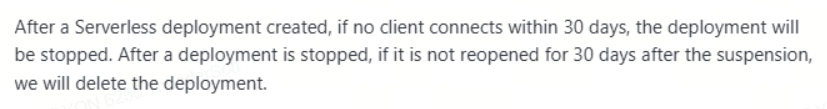

EMQX Serverless Deployment Setup Guide

1. Introduction

Welcome to the setup tutorial for deploying EMQX in a serverless environment. EMQX is a popular open-source MQTT messaging broker known for its scalability, high performance, and compatibility with IoT systems. This guide will help you quickly set up and configure EMQX in a serverless environment, allowing you to benefit from its reliability without managing underlying infrastructure. Explore [more](https://www.emqx.com/en)

Using EMQX in a serverless setup simplifies deployment and management, ensuring that the infrastructure scales automatically based on workload, reducing operational overhead, and optimizing costs.

2. Prerequisites

Before getting started, ensure you have the following:

EMQX Cloud Account: You need an account to access the EMQX Cloud Console. Sign up [Here](https://accounts.emqx.com/signin).

Network Permissions: Ensure that you have access to the internet and that no firewall rules block outbound communication on ports 1883 (MQTT), 8083 (WebSocket), or other relevant ports.


3. Setup Instructions

Follow these steps to deploy EMQX serverless using the EMQX Cloud Console:

Navigate to the EMQX Cloud Console: Go to EMQX Cloud Console.

Log in or Create an Account:

If you do not already have an account, sign up using your email or third-party options (e.g., Google, GitHub).

Once logged in, you will be directed to the dashboard.

Create a New Deployment:

Click on "Create Deployment".

Select "Serverless Deployment".

Choose a Cloud Provider and Region that best suits your needs.

Configure Deployment Options:

Enter a Deployment Name that uniquely identifies your setup.

Choose the Auto-Scaling options to let EMQX scale resources based on demand automatically.

Launch the Deployment:

Click "Deploy" to initiate the serverless instance.

The deployment process takes a few minutes. Once done, you will see the details under the Deployments section.


SSL/TLS Configuration: Once the serverless deployment is complete, the EMQX Cloud Console provides a CA certificate for secure communication. You can download this CA certificate from the Connection Information section in the EMQX Cloud Console.


Publishing Example:

```bash
mosquitto_pub -h <your-emqx-broker-url> -p 8883 -t "arcade/machine/123/coinpulse" -m '{"machineId": "machine_123", "credits": 1, "timestamp": "2024-10-15T00:42:34.019303Z"}' --cafile "path/to/ca.crt" -u "<your-username>" -P "<your-password>"
```

```bash
mosquitto_pub -h <your-emqx-broker-url> -p 8883 -t "arcade/machine/123/gameover" -m '{"machineId": "machine_123", "status": "game_over", "timestamp": "2024-10-15T02:42:34.019303Z"}' --cafile "path/to/ca.crt" -u "<your-username>" -P "<your-password>"
```

Subscribing Example:

```bash
mosquitto_sub -h <your-emqx-broker-url> -p 8883 -t arcade/machine/+/coinpulse -t arcade/machine/+/gameover --cafile "path/to/ca.crt" -u "<your-username>" -P "<your-password>"
```

5. Testing the Deployment

To verify that your EMQX deployment is functioning correctly:

Connect an MQTT Client:

Use a tool like Mosquitto to connect to your EMQX server.

Use the broker URL provided in your deployment dashboard (e.g. g38a1ef7.ala.asia-southeast1.emqxsl.com).

Publish and Subscribe to a Topic:

Connect to the broker and subscribe to a test topic, e.g., test/topic.

Publish a message to the same topic and verify that the message is received.

Check the Dashboard:

Go back to the EMQX Cloud Console to check if the connections and message metrics are reflected in real-time.

6. Troubleshooting

If you encounter issues, consider the following common solutions:

Deployment Failed: Ensure your cloud provider region is available and supported by EMQX.

Client Connection Issues: Verify that your MQTT client is using the correct URL, port, and credentials.

Firewall Restrictions: Check that no firewall rules are blocking required ports.

For more troubleshooting tips, see the EMQX Troubleshooting Guide.

7. Extra Information
- 

- This is the [guide](https://www.emqx.com/en/blog/using-mqtt-in-unity-with-m2mqttunity-library-a-step-by-step-guide) for setup mqtt with unity
  
