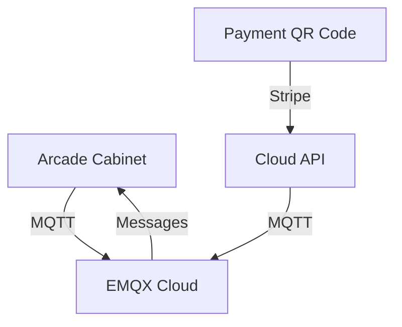

# Understanding the Code

Welcome to the code overview! Let's break down how our arcade payment system works under the hood. :gear:

## System Architecture Overview :building_construction:

Our arcade payment system consists of several key components working together:



## Main Application Code :computer:

Our main application (`app.py`) handles payment processing and game control. Let's break it down section by section:

### 1. Import and Setup

```python
import os
import stripe
import paho.mqtt.client as mqtt
from flask import Flask, request, jsonify
from dotenv import load_dotenv
import awsgi
```

These imports give us:

    * `stripe` - Payment processing
    * `paho.mqtt` - Messaging between components
    * `flask` - Web API framework
    * `dotenv` - Environment configuration
    * `awsgi` - AWS Lambda integration

## Understanding Web Concepts 🌐

!!! info "What is an Endpoint?"
    An endpoint is like a doorway into our application - it's a specific URL where other programs can interact with our system. Think of it like this:
    
    * Your house has a front door, back door, and maybe a garage door
    * Each door serves a different purpose (visitors, taking out trash, parking car)
    * Similarly, our API has different endpoints for different purposes
    * Each endpoint has a specific address (URL) and purpose

    For example, `/status` is like a doorbell - other systems can "ring" it to check if our system is working!

!!! info "What is a Webhook?"
    A webhook is like having a friend who agreed to call you whenever something specific happens. In our system:

    1. We tell Stripe: "Hey, call this phone number (URL) when someone pays"
    2. When a player makes a payment, Stripe calls our webhook
    3. Our webhook answers the call and processes the payment
    4. Then it tells the arcade cabinet to add credits

    Think of it like ordering pizza:

    * You give the pizza place your address (setting up the webhook)
    * When the pizza is ready, they deliver it to you (Stripe calls our webhook)
    * You receive the pizza and eat it (we process the payment data)

!!! example "Real World Example"
    Let's say a player wants to play your arcade game:

    1. They scan the QR code
    2. They pay through Stripe
    3. Stripe calls our webhook to say "Payment successful!"
    4. Our webhook using our /addCredit endpoint to tell the arcade cabinet "Add credits!"
    5. The game starts!

### 2. MQTT Configuration :satellite:

The MQTT client helps our system communicate with the arcade cabinet:

```python
client = mqtt.Client()
client.username_pw_set(username=os.getenv("MQTT_USERNAME"), 
                      password=os.getenv("MQTT_PASSWORD"))
```

!!! tip "What is MQTT?"
    MQTT is like a text messaging system for machines. It lets our cloud service "text" the arcade cabinet when someone pays!

### 3. Key Endpoints :door:

#### Status Check
```python
@app.route('/status', methods=['GET'])
def status():
    return jsonify({
        "status": "up",
        "message": "API is running"
    })
```
This tells us if our system is running.

#### Payment Creation
```python
@app.route('/create-payment-link', methods=['POST'])
def create_payment_link():
    # Creates a QR code payment link
```
!!! example "Create Payment Link"
    1. Developer calls this endpoint from terminal
    2. Stripe creates a new payment page for this cabinet
    3. Stripe returns a URL that can be used to generate a QR Code
    4. QR Code can be printed or built into the attract screen

#### Add Credit
```python
@app.route('/addCredit', methods=['POST'])
def stripe_webhook():
    # Handles successful payments
```

!!! example "Add Credit"
    1. Player scans QR code
    2. Makes payment through Stripe
    3. Success message sent to cabinet
    4. Game starts!

!!! tip "Webhook Security"
    Just like you wouldn't want strangers entering your house, we need to make sure only Stripe can use our webhook. We do this by checking a special signature (like a secret handshake) on every webhook request:

    ```python
    stripe.Webhook.construct_event(payload, sig_header, webhook_secret)
    ```

When someone pays:

    1. Stripe tells our API running in the cloud
    2. We verify the payment message is from stripe
    3. Send "coin pulse" to our MQTT Messenger
    4. Our cabinet game listens for the "coin pulse" message.
    5. Cabinet adds credits

#### Game Over
```python
@app.route('/gameover', methods=['POST'])
def game_over():
    # Handles end of game
```

When a game ends:

    1. Cabinet sends signal to our MQTT messenger
    2. System updates status and the "attract screen" begins playing
    3. Ready for next player

## Message Formats :envelope:

### Coin Pulse Signal
This tells the cabinet to add credits:
```json
{
    "machineId": "arcadeCabinet-123",
    "credits": 1,
    "timestamp": "2024-07-01T12:00:00Z"
}
```

### Game Over Signal
This tells the system the game is done:
```json
{
    "machineId": "arcadeCabinet-123",
    "status": "game_over",
    "timestamp": "2024-07-01T12:30:00Z"
}
```

## Docker Configuration :whale:

Our `Dockerfile` sets up the environment:

```dockerfile
FROM public.ecr.aws/lambda/python:3.9
COPY app.py ca.crt ${LAMBDA_TASK_ROOT}
COPY requirements.txt ./
RUN pip install -r requirements.txt
CMD ["app.lambda_handler"]
```

!!! info "Why Docker?"
    Docker is like a shipping container for code. It ensures our code runs the same way everywhere!

## Required Libraries :books:

Our `requirements.txt` lists what we need:
```text
Flask==3.0.3
python-dotenv==1.0.1
stripe==10.9.0
aws-wsgi==0.2.7
paho-mqtt==1.6.1
```

!!! info "What are Libraries? 📚"
    Libraries are like recipe books for programmers. Instead of writing all the code from scratch, we can use pre-written code that others have created and tested:

    * `Flask` is like a cookbook for building web services
    * `stripe` is a recipe book for handling payments
    * `paho.mqtt` contains recipes for sending messages between machines
    * `python-dotenv` helps us keep our secret ingredients (passwords) safe
    * `aws-wsgi` helps our code work with AWS's kitchen (cloud servers)

    Just like you wouldn't want to figure out a cake recipe from scratch every time, programmers use libraries to avoid "reinventing the wheel"!

!!! example "Real World Example"
    Imagine you're baking a cake:

    * Instead of creating a recipe from scratch, you use a cookbook (library)
    * The cookbook tells you exactly what ingredients you need
    * It gives you tested steps to follow
    * You get consistent results every time

    That's exactly what our `requirements.txt` file does - it's like our shopping list of cookbooks!

## Security Features :lock:

The code includes several security measures:

    * SSL/TLS encryption for MQTT
    * Stripe webhook verification
    * Environment variable protection
    * AWS Lambda security

!!! warning "API Keys"
    Never share your API keys or passwords! They should always stay secret.

## Code Flow Examples :arrows_counterclockwise:

### Payment Flow

    1. Player scans QR code
    2. System creates Stripe payment
    3. Player pays through Stripe
    4. Webhook receives success
    5. MQTT sends coin pulse
    6. Game starts

### Game End Flow

    1. Game finishes
    2. Cabinet sends game over
    3. System updates status
    4. Ready for next player

## Next Steps :footprints:

Now that you understand the code:

    1. Try making small changes
    2. Test different features
    3. Add your own improvements

[Start Making Changes →](modifications.md){ .md-button .md-button--primary }
[Back to Overview](overview.md){ .md-button }

!!! question "Need Help?"
    * Check our [Troubleshooting Guide](../troubleshooting/common-issues.md)
    * Ask your teacher or mentor
    * Review the code comments
    * Try our example exercises