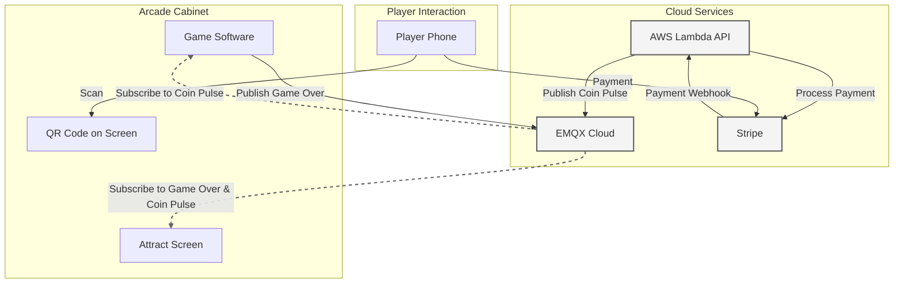

# System Architecture

Welcome to the technical overview of your arcade system! Let's break down how all the pieces work together to create a modern arcade experience. 🎮

## System Overview 🌐

Your arcade system has three main parts working together:

1. **The Arcade Cabinet**: Where the games run and players interact
2. **Cloud Services**: Handles payments and communication
3. **Player's Phone**: How players make payments

!!! tip "Think of it Like a Restaurant"
    * The Arcade Cabinet is like the kitchen where food (games) is prepared
    * Cloud Services are like the waiters taking orders and payments
    * The Player's Phone is like a self-service ordering kiosk

## System Diagram

## Core Components 🧩

### 1. Arcade Cabinet Components

The cabinet runs three main pieces of software:

* **Game Software**: 
    * Runs the actual games
    * Subscribes to coin pulse messages to start games
    * Sends game over messages when play ends
    * Handles player controls and game logic

* **Attract Screen**: 
    * Shows animations when no one is playing
    * Displays the QR code for payments
    * Subscribes to both coin pulse and game over messages
    * Switches between game and attract mode automatically

!!! info "Message Subscriptions"
    Both the Game Software and Attract Screen are "subscribers" - they listen for specific messages from the cloud:
    * Game Software listens for "coin pulse" to know when to start
    * Attract Screen listens for both "coin pulse" and "game over" to know when to switch modes

### 2. Cloud Services

Your system uses three cloud services that work together:

1. **EMQX Cloud**

    * Acts as the message hub for your system
    * Receives coin pulse messages from Lambda
    * Receives game over messages from games
    * Delivers messages to all subscribers
    * Handles all real-time communication

2. **AWS Lambda**

    * Runs your payment API
    * Processes Stripe webhook events
    * Publishes coin pulse messages to EMQX
    * Manages game states

3. **Stripe**

    * Handles all payments securely
    * Creates payment pages
    * Sends webhook notifications to Lambda
    * Manages refunds if needed

!!! example "Message Flow Example"
    When a player pays:

    1. Stripe tells Lambda "Payment successful!" via webhook
    2. Lambda publishes a coin pulse message to EMQX
    3. EMQX delivers the message to both:
        * Game Software (which starts the game)
        * Attract Screen (which switches modes)

### 3. Communication Protocols

The system uses two main types of communication:

1. **HTTPS** (for payments)
    * Secure web communication
    * Used for payment processing
    * Handles webhook events
    * Protects sensitive data

2. **MQTT** (for real-time messaging)
    * Fast, publish-subscribe messaging system
    * Handles coin pulse messages
    * Manages game over signals
    * Provides real-time updates

## How Everything Works Together 🔄

Let's follow a complete game session:

### 1. Starting a Game

1. Player approaches cabinet and sees attract screen
2. Scans QR code with phone
3. Makes payment through Stripe
4. Stripe notifies Lambda via webhook
5. Lambda publishes coin pulse to EMQX
6. EMQX delivers message to subscribers:
    * Game Software starts the game
    * Attract Screen switches to game mode

### 2. During Gameplay

* Game Software runs the game
* Player uses arcade controls
* Cloud services stand by
* Attract Screen stays in game mode

### 3. Ending a Game

1. Game finishes
2. Game Software publishes game over to EMQX
3. EMQX delivers message to Attract Screen
4. Attract Screen resumes attract mode
5. Ready for next player!

## Security Features 🔐

Your system includes several security measures:

1. **Payment Security**
    * Stripe handles all card data
    * Encrypted connections
    * Webhook verification
    * Fraud prevention

2. **Message Security**
    * SSL/TLS encryption
    * Authentication required
    * Secure protocols
    * Access controls

3. **Cabinet Security**
    * Local credit management
    * Secured connections
    * Protected game files
    * State verification

!!! warning "Security Best Practices"
    * Keep all API keys private
    * Don't share access credentials
    * Monitor system logs
    * Update software regularly

## Scalability 📈

The system is designed to grow:

* Handles multiple cabinets
* Scales automatically
* Uses serverless technology
* Stays within free tiers

!!! tip "Start Small, Think Big"
    You can start with one cabinet and add more later - the system grows with you!

## Next Steps 🚀

Now that you understand the architecture:

1. Learn about the [Payment Flow](payment-flow.md)
2. Explore [Game Control](game-control.md)
3. Dive into [Cloud Services](cloud-services.md)

[Continue to Payment Flow →](payment-flow.md){ .md-button .md-button--primary }
[Back to Overview](../getting-started/overview.md){ .md-button }

!!! question "Need Help?"
    * Check our [Troubleshooting Guide](../troubleshooting/common-issues.md)
    * Ask your teacher or mentor
    * Review the code examples
    * Try our tutorials