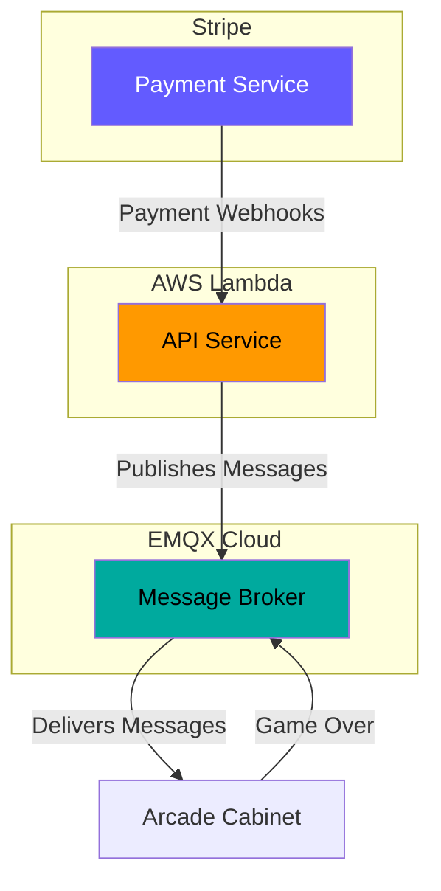
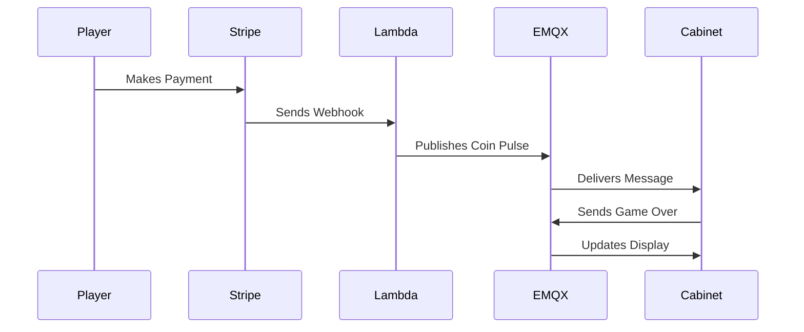

# Cloud Services

Welcome to cloud services! This is where we'll explore the online systems that power your arcade cabinet. Think of these services as your arcade's behind-the-scenes crew - they handle payments, send messages, and keep everything running smoothly! ☁️

## The Big Picture 🎯

Your arcade uses three main cloud services:



!!! tip "Think of it Like a Restaurant"
    * AWS Lambda is like the waiter taking orders
    * EMQX is like the kitchen intercom system
    * Stripe is like the cash register
    * Your cabinet is like the kitchen cooking up games!

## AWS Lambda ⚡

### What it Does

AWS Lambda runs your arcade's API (Application Programming Interface) in the cloud:

* Processes payments from Stripe
* Sends start game signals
* Handles game over messages
* Creates QR codes for payments
* Manages multiple cabinets

!!! info "Why Lambda?"
    Lambda is "serverless" which means:
    
    * You don't manage any servers
    * It runs only when needed
    * Scales automatically
    * Perfect for arcade cabinets!

### Key Features

1. **API Endpoints**
    * `/create-payment-link` - Makes QR codes
    * `/addCredit` - Processes payments
    * `/gameover` - Handles game endings
    * `/status` - Checks system health

2. **Free Tier Benefits**
    * 1 million requests per month free
    * 400,000 GB-seconds compute time
    * Perfect for arcade systems
    * Room to grow

## EMQX Cloud 📡

### What it Does

EMQX is your messaging system:

* Connects cabinets to the cloud
* Delivers messages instantly
* Handles real-time updates
* Keeps everything in sync

!!! example "Message Types"
    EMQX handles two main messages:
    
    1. Coin Pulse (Start Game):
    ```json
    {
        "machineId": "arcade123",
        "credits": 1,
        "timestamp": "2024-07-01T12:00:00Z"
    }
    ```
    
    2. Game Over:
    ```json
    {
        "machineId": "arcade123",
        "status": "game_over",
        "timestamp": "2024-07-01T12:30:00Z"
    }
    ```

### Free Tier Features

* 1 million session minutes/month
* 1 GB traffic/month
* Perfect for getting started
* Easy to upgrade later

## Stripe 💳

### What it Does

Stripe handles all your payments:

* Creates payment pages
* Processes credit cards
* Sends success messages
* Handles refunds if needed

!!! tip "Test vs Live Mode"
    Stripe has two modes:
    
    * Test Mode: Practice with fake cards
    * Live Mode: Real payments when ready

### Key Features

1. **Payment Links**
    * Easy QR code generation
    * Mobile-friendly pages
    * Secure processing
    * Instant confirmation

2. **Webhooks**
    * Instant payment notification
    * Secure delivery
    * Automatic retries
    * Payment verification

## How They Work Together 🤝

Let's follow a payment through the system:



1. **Payment Flow**
    * Player scans QR code
    * Pays through Stripe
    * Stripe notifies Lambda
    * Lambda tells EMQX
    * EMQX messages cabinet
    * Game starts!

2. **Game Over Flow**
    * Game ends
    * Cabinet tells EMQX
    * System resets
    * Ready for next player

## Free Tier Limits 📊

Each service has free limits:

1. **AWS Lambda**
    * 1M requests/month
    * 400K GB-seconds
    * Never expires

2. **EMQX Cloud**
    * 1M minutes/month
    * 1 GB traffic
    * Basic monitoring

3. **Stripe**
    * No monthly fees
    * 2.9% + $0.30 per payment
    * Full test mode

!!! success "Perfect for Learning!"
    These free tiers are designed for:
    
    * Learning the system
    * Testing everything
    * Starting your business
    * Growing over time

## Security Features 🔒

Your cloud services are protected by:

1. **AWS Security**
    * API authentication
    * Encrypted traffic
    * Role-based access
    * Activity monitoring

2. **EMQX Security**
    * TLS encryption
    * Client authentication
    * Access control
    * Secure protocols

3. **Stripe Security**
    * PCI compliance
    * Fraud detection
    * Webhook signatures
    * Data encryption

## Monitoring & Debugging 🔍

Each service provides monitoring:

### AWS CloudWatch
* API request logs
* Error tracking
* Performance metrics
* Usage statistics

### EMQX Dashboard
* Connection status
* Message delivery
* Client activity
* System health

### Stripe Dashboard
* Payment history
* Transaction details
* Webhook logs
* Error reports

!!! tip "Staying Informed"
    Check your dashboards for:
    
    * System health
    * Error messages
    * Usage patterns
    * Payment issues

## Next Steps 🚀

Now that you understand the cloud services:

1. Set up your accounts
2. Test the system
3. Monitor activity
4. Start accepting payments!

[Back to Game Control](game-control.md){ .md-button }
[Start Setup →](../getting-started/prerequisites.md){ .md-button .md-button--primary }

!!! question "Need Help?"
    * Check our [Troubleshooting Guide](../troubleshooting/common-issues.md)
    * Ask your teacher or mentor
    * Review service documentation
    * Try our cloud tutorials