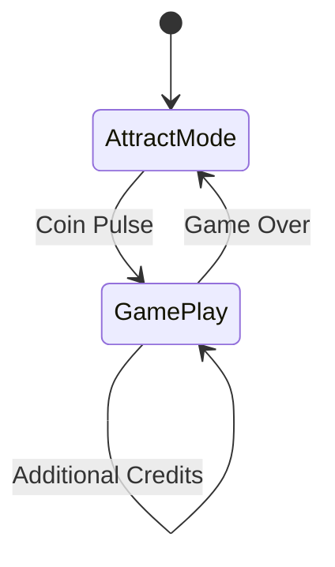
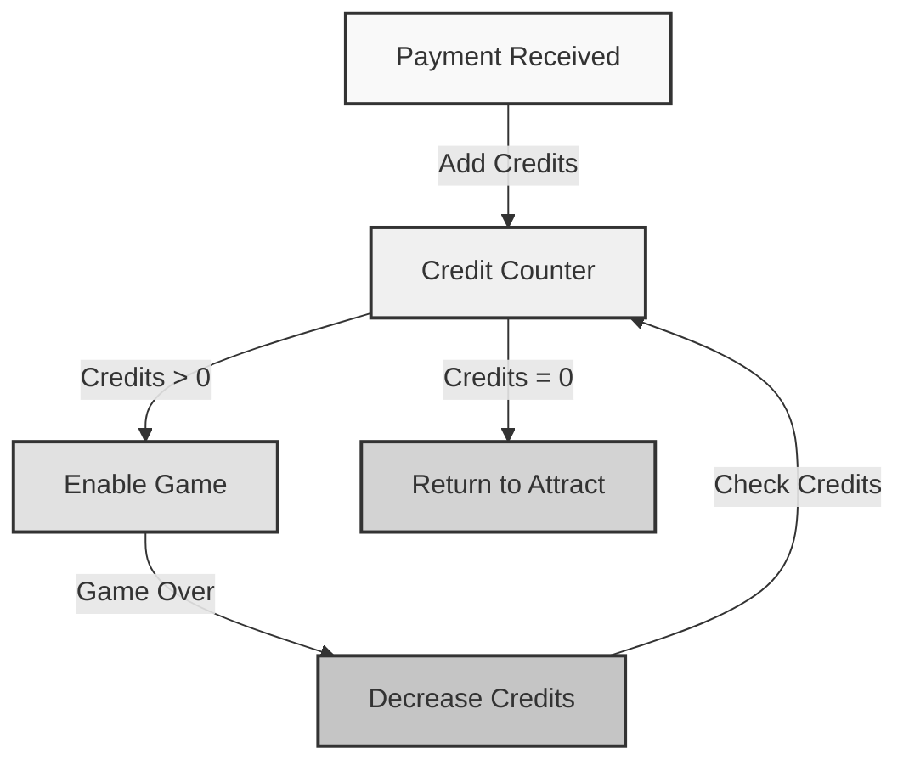

# Game Control

Welcome to the game control guide! Here's where we'll explore how your arcade system manages games - from starting them up to handling game overs. Let's dive in! 🎮

## Quick Overview 🎯

Your arcade's game control system:

* Starts games when players pay
* Manages credits and play time
* Handles game over signals
* Controls the attract screen
* Keeps everything in sync

!!! tip "Think of it Like a DJ System"
    * The attract screen is like playing music between sets
    * Starting a game is like starting your main playlist
    * Game over is like finishing your set
    * The system smoothly transitions between these modes!

## How Games Are Controlled 🕹️

### 1. State Management



Your cabinet has two main states:

1. **Attract Mode**
    * Shows demo animations
    * Displays QR code
    * Waits for payment
    * Monitors for coin pulse

2. **Game Play Mode**
    * Runs the active game
    * Tracks remaining credits
    * Monitors game status
    * Listens for game over

!!! info "State Transitions"
    The system smoothly handles changes between states:
    
    * Attract → Game: When payment received
    * Game → Attract: When game ends
    * Game → Game: When more credits added

### 2. Credit System 💰

The credit system manages:



* Credit addition from payments
* Credit deduction after games
* Multi-credit game support
* Credit persistence

!!! example "Credit Scenarios"
    Here's how credits work:
    
    * Player pays $1 → 1 credit added
    * Game starts → 1 credit used
    * Player adds more credits → Queue for next game
    * Game ends → Check for remaining credits

### 3. Game Start Process 🚀

When credits are added:

1. System receives coin pulse message
   ```json
   {
       "machineId": "your-machine-id",
       "credits": 1,
       "timestamp": "2024-07-01T12:00:00Z"
   }
   ```

2. The cabinet software:
    * Verifies the machine ID
    * Adds the specified credits
    * Switches to game mode
    * Starts the game

!!! warning "Start-up Checks"
    Before starting a game, the system verifies:
    
    * Valid machine ID
    * Sufficient credits
    * Game is ready
    * No active games running

### 4. During Gameplay ⚡

While a game is running:

* System monitors game status
* Tracks remaining credits
* Listens for game over
* Handles additional payments

!!! tip "Multi-Credit Games"
    Some games might need multiple credits:
    
    * Fighting games: 1 credit per player
    * Premium games: 2 credits per play
    * Extended play: Credits for continue

### 5. Game Over Handling 🔄

When a game ends:

1. Game sends over signal
   ```json
   {
       "machineId": "your-machine-id",
       "status": "game_over",
       "timestamp": "2024-07-01T12:30:00Z"
   }
   ```

2. System processes game over:
    * Updates credit count
    * Checks for remaining credits
    * Decides next state
    * Updates display

!!! info "Game Over Flow"
    The system checks:
    
    1. Are there more credits?
        * Yes → Start new game
        * No → Return to attract mode
    2. Was this a multi-credit game?
        * Update credit display
        * Handle any remaining balance

## Error Handling 🔧

The system handles various game control issues:

### 1. Game Crashes

If a game crashes:

* Credits are preserved
* System logs the error
* Cabinet returns to attract mode
* Player can start again

### 2. Power Issues

If power is lost:

* Credit state is saved
* System recovers on restart
* Games resume if possible
* Players don't lose credits

!!! danger "Data Protection"
    The system protects player credits by:
    
    * Saving credit state regularly
    * Using persistent storage
    * Implementing recovery logic
    * Maintaining transaction logs

## Testing Game Control 🧪

You can test the system using:

1. Manual Tests:
    * Add test credits
    * Start games
    * Trigger game overs
    * Check state transitions

2. Automated Tests:
    * Send test MQTT messages
    * Verify credit handling
    * Check state management
    * Test error recovery

!!! tip "Testing Best Practices"
    Always test:
    
    * Multiple credit scenarios
    * Rapid game starts/stops
    * Power loss recovery
    * Multi-player games

## Monitoring & Debugging 📊

Keep track of your games:

1. System Logs:
    * Game start/stop events
    * Credit changes
    * Error conditions
    * State transitions

2. MQTT Messages:
    * Coin pulse receipts
    * Game over signals
    * State changes
    * Error notifications

3. Cabinet Status:
    * Current game state
    * Credit count
    * Active players
    * System health

## Next Steps 🚀

Now that you understand game control:

1. Learn about [Cloud Services](cloud-services.md)
2. Try testing different scenarios
3. Explore credit management

[Continue to Cloud Services →](cloud-services.md){ .md-button .md-button--primary }
[Back to Payment Flow](payment-flow.md){ .md-button }

!!! question "Need Help?"
    * Check our [Troubleshooting Guide](../troubleshooting/common-issues.md)
    * Ask your teacher or mentor
    * Review the code examples
    * Try our game control tutorials