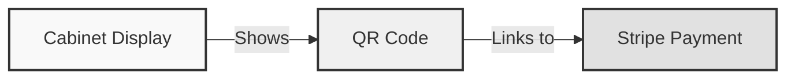
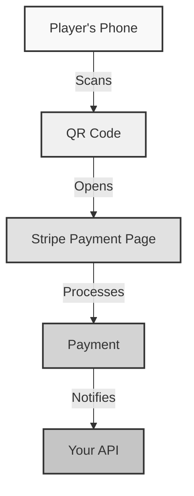
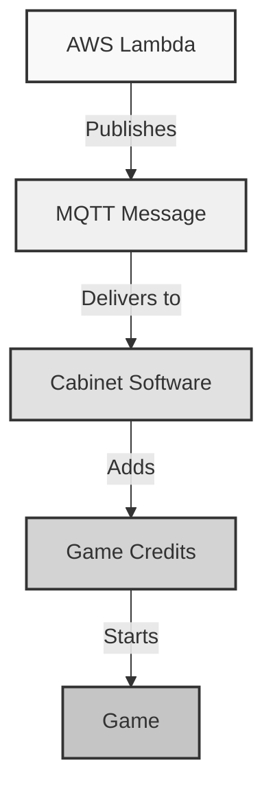

# Payment Flow

Welcome to the payment flow guide! Let's explore how money gets from a player's phone to your arcade cabinet. Let's make this fun! 💸

## Quick Overview 🎯

Here's the basic flow when someone wants to play your arcade:

1. Player sees QR code on cabinet
2. Scans code with phone
3. Makes payment through Stripe
4. Game starts automatically!

!!! tip "Think of it Like a Vending Machine"
    * The QR code is like the card reader
    * Stripe is like the payment processor inside
    * The coin pulse is like the spiral turning to drop your snack
    * The game starting is like getting your treat!

## Detailed Payment Flow 🔄

Let's break down exactly what happens in each step:

### 1. QR Code Generation 📱



* Your cabinet shows a QR code during attract mode
* Each code is unique to your cabinet
* The code contains your cabinet's ID
* QR codes are generated through Stripe

!!! info "How QR Codes Work"
    The QR code contains a special URL that:
    
    * Links to your Stripe payment page
    * Includes your cabinet's ID
    * Sets the correct price
    * Ensures proper tracking

### 2. Payment Processing 💳



When a player pays:

1. They scan your QR code
2. Their phone shows the Stripe payment page
3. They enter their payment info
4. Stripe processes the payment
5. Success! Time for the next step

!!! example "Payment Page Example"
    Your payment page shows:
    
    * Your arcade name
    * The price per play
    * Secure payment form
    * Confirmation message

### 3. Webhook Notification 📨

After successful payment:

1. Stripe immediately sends a webhook to your API
2. Your API verifies the webhook is legitimate
3. The webhook contains:
    * Payment amount
    * Cabinet ID
    * Transaction details
    * Timestamp

!!! warning "Security First!"
    Your API always verifies webhooks by:
    
    * Checking the Stripe signature
    * Validating the cabinet ID
    * Confirming the payment amount
    * Ensuring no duplicate processing

### 4. Credit Management 🎮

Once payment is verified:



1. Your API creates a "coin pulse" message
2. EMQX delivers it to your cabinet
3. The cabinet software:
    * Adds the credits
    * Starts the game
    * Updates the display

!!! tip "Credit Calculation"
    Credits are calculated based on:
    
    * Payment amount
    * Your price settings
    * Any active promotions
    * Multi-play discounts

## Message Formats 📝

### Coin Pulse Message

When credits are added:

```json
{
    "machineId": "your-machine-id",
    "credits": 1,
    "timestamp": "2024-07-01T12:00:00Z"
}
```

### Payment Confirmation

What Stripe sends to your API:

```json
{
    "type": "checkout.session.completed",
    "data": {
        "object": {
            "metadata": {
                "machine_id": "your-machine-id"
            },
            "amount_total": 100
        }
    }
}
```

## Error Handling 🔧

The system handles various payment issues:

### Payment Failures

If payment fails:

* Player sees clear error message
* No credits are added
* Cabinet stays in attract mode
* Player can try again

### Network Issues

If connection drops:

* Payments are never lost
* System retries message delivery
* Cabinet maintains state
* Records are reconciled automatically

!!! danger "Preventing Double Credits"
    The system prevents duplicate credits by:
    
    * Tracking transaction IDs
    * Verifying webhook signatures
    * Maintaining state records
    * Using idempotency keys

## Testing Payments 🧪

You can test the system using:

1. Stripe test cards:
    * Success: 4242 4242 4242 4242
    * Decline: 4000 0000 0000 0002
    * Error: 4000 0000 0000 9995

2. Test webhook events:
    * Use Stripe CLI
    * Send test webhooks
    * Monitor responses
    * Check credit addition

!!! tip "Testing Best Practices"
    Always test:
    
    * Different payment amounts
    * Failed payments
    * Network disconnections
    * Multiple rapid payments

## Monitoring & Debugging 📊

Keep track of your payments:

1. Stripe Dashboard:
    * View all transactions
    * Check payment status
    * Handle refunds
    * Monitor disputes

2. AWS CloudWatch:
    * Watch API logs
    * Monitor webhooks
    * Track errors
    * Set up alerts

3. EMQX Console:
    * View message flow
    * Check connections
    * Monitor delivery
    * Debug issues

## Next Steps 🚀

Now that you understand payments:

1. Learn about [Game Control](game-control.md)
2. Explore [Cloud Services](cloud-services.md)
3. Try setting up test payments

[Continue to Game Control →](game-control.md){ .md-button .md-button--primary }
[Back to Architecture](architecture.md){ .md-button }

!!! question "Need Help?"
    * Check our [Troubleshooting Guide](../troubleshooting/common-issues.md)
    * Ask your teacher or mentor
    * Review the code examples
    * Try our payment tutorials