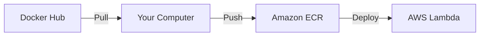

# Pulling the Docker Image

Welcome to the Docker pull guide! Let's get the arcade software onto your computer so we can deploy it to AWS. :whale:

## Before You Start :clipboard:

Make sure you have:

* Docker Desktop installed and running
* Terminal or PowerShell open
* AWS account set up

!!! tip "Not Ready?"
    Need to install Docker? Check our [Prerequisites Guide](../getting-started/prerequisites.md) first!

## Understanding Docker Images :thinking:

Before we pull the image, let's understand what we're doing:

!!! info "What's a Docker Image?"
    Think of a Docker image like a video game installer:
    
    * It contains all the software we need
    * It's pre-configured and ready to run
    * It works the same way on every computer
    * You can share it easily with others

## Pulling the Image :arrow_down:

1. Open your terminal or PowerShell and run:

```bash
docker pull yeeyon/arcade-stem:latest
```

!!! note "Image Not Found?"
    If you see an error about the image not being found, check with your teacher or mentor for the correct image URL.

2. Verify the pull was successful:

```bash
docker images
```

You should see something like:

```
REPOSITORY                TAG       IMAGE ID       CREATED        SIZE
yeeyon/arcade-stem        latest    abc123def456   1 minute ago   156MB
```

## Testing the Image :test_tube:

Let's make sure the image works:

1. Run a test container:

```bash
docker run --platform linux/amd64 --rm yeeyon/arcade-stem:latest echo "Hello from arcade container"
```

2. You should see:

```
Hello from arcade container!
```

!!! success "What Did We Do?"
    * `docker run` starts a container
    * `--rm` removes it when finished
    * `echo "Hello..."` tests that it works
    * `--platform linux/amd64` ensures compatibility with Apple Silicon Macs
    * If you see the message, your image is working!

## Checking Image Details :mag:

View detailed information about your image:

```bash
docker inspect yeeyon/arcade-stem:latest
```

This shows you:

* When it was created
* What operating system it uses
* What settings it has
* And lots more!

## Next Steps: Setting Up Lambda :rocket:

Now that you have the Docker image on your computer, it's time to:

1. Push it to Amazon ECR
2. Set up AWS Lambda to use your image
3. Configure your cloud API

The next guide will walk you through these steps!

[Continue to Lambda Setup →](aws-lambda/quick-deploy-lambda-setup.md){ .md-button .md-button--primary }
[Back to Quick Deploy Overview](overview.md){ .md-button }


## Troubleshooting :wrench:

### Common Issues

**Docker Not Running**
```bash
Cannot connect to the Docker daemon
```

* Make sure Docker Desktop is running
* Try restarting Docker Desktop

**Disk Space Issues**
```bash
no space left on device
```

* Clear old Docker images: `docker system prune`
* Free up disk space

**Slow Download**

* Check your internet connection
* Try again later
* Ask if there's a local copy available

!!! question "Need Help?"
    * Check our [Troubleshooting Guide](../troubleshooting/common-issues.md)
    * Ask your teacher or mentor
    * Visit [Docker's documentation](https://docs.docker.com)

## Understanding the Process :bulb:

Here's what's happening when you pull and push Docker images:



!!! tip "Keep Terminal Open"
    After successfully pulling the image, keep your terminal open - you'll need it for the next step when pushing to ECR!

Remember, pulling the Docker image is just the first step. Next, we'll get it into AWS where it can power your arcade cabinet's payment system!